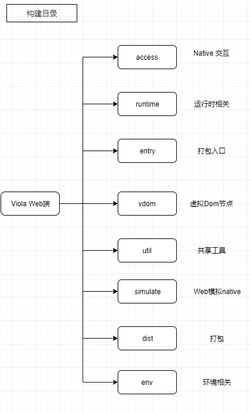
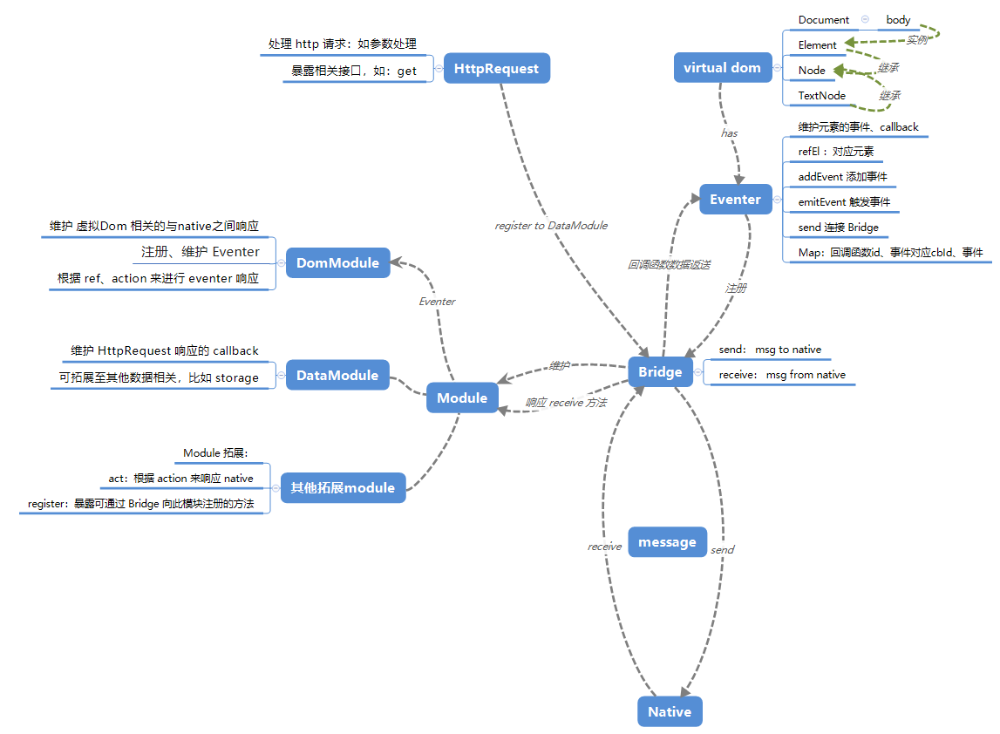
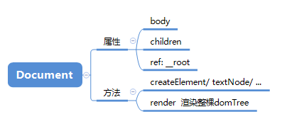
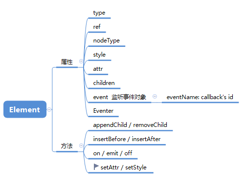
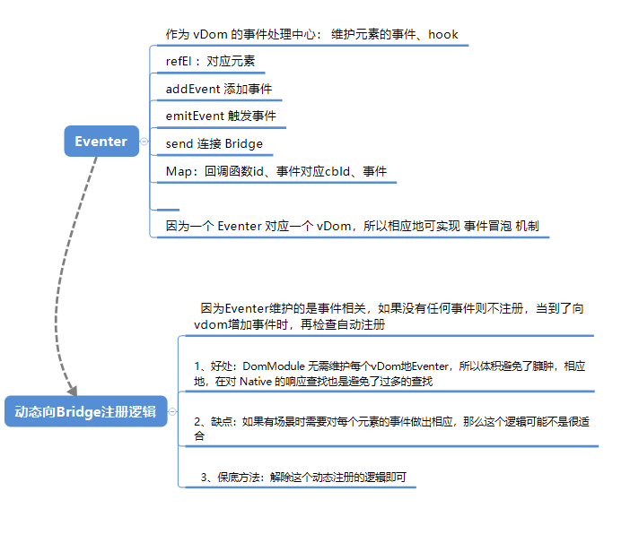
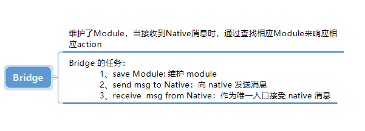
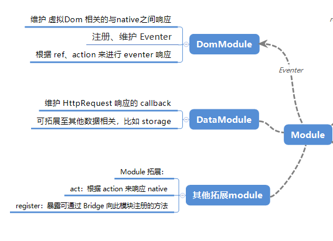

# Viola js

## 是什么 ?

  简单的来讲：
    
  - Viola 上会有一个 js 引擎，可以用来运行 js 代码
  - js 环境中，native 端会注入一些通讯方法，供两边通讯，如：`callNative(...)`
  - 但是，不存在浏览器的对象、接口如：`document`, `document.createElement()`
  - 所以，可以简单理解为，viola js层是用来垫上缺失的**部分**浏览器对象及其接口

  用代码来解释就是, 在 Viola 和 浏览器都能执行以下代码：

  ``` javascript
  let div = document.createElement('div')
  div.addEventListener('click', (e) => {})
  document.body.appendChild(div)
  ```

## 实现

  
  
  整体架构：

  
  
  - Document

    

  - Element
    
    
     
  - Eventer

    

  - Bridge

    
    
  - Module

    

## 构建相关

  在构建选择上，我思考的方向是，打包出来的 Viola js 应该尽量的简洁、简单，不要太多杂余代码。

  于是就有下面的选择方向：

  ### 构建工具的选择 —— `Rollup`

  #### `Rollup` 是什么？
  > `Rollup` 是下一代 ES6 模块化工具。 利用 ES2015 巧妙的模块设计，尽可能**高效**地构建出能够直接被其它 `JavaScript` 库引用的模块。所有的代码都放在同一个地方，然后一次性执行，从而生成更简洁、更简单的代码，从而启动更快

  #### 优势在哪？

  - 1、生成更简洁、更简单的代码

    > 此处拿 `Webpack` 作为比较
    
    引用的模块：
    ``` javascript
    // a.js
    export default 10;
    ```
    入口文件:
    ``` javascript
    // main.js
    import multiplier from './a.js';

    export function someMaths() {
      console.log(multiplier);
    }
    ```
    `webpack` 打包结果：~ `4000 bytes`

    ``` javascript
    module.exports =
    /******/ (function(modules) { // webpackBootstrap
    /******/   // The module cache
    /******/   var installedModules = {};
    /******/
    /******/   // The require function
    /******/   function __webpack_require__(moduleId) {
    /******/
    /******/      // Check if module is in cache
    /******/      if(installedModules[moduleId]) {
    /******/         return installedModules[moduleId].exports;
    /******/      }
    /******/      // Create a new module (and put it into the cache)
    /******/      var module = installedModules[moduleId] = {
    /******/         i: moduleId,
    /******/         l: false,
    /******/         exports: {}
            .........
    ```
    
    `Rollup` 打包结果：~ `200 bytes`

    ``` javascript
    'use strict'

    var multiplier = 10;

    function someMaths() {
      console.log(multiplier);
    }

    exports.someMaths = someMaths;
    ```
    
  - 2、`Tree-shaking`

    - 没有使用额外的模块系统，直接定位import来替换export的模块；

    - 去掉了未被使用的代码
  
    这个概念是 Rollup 提出来的。

    Rollup 推荐使用 ES2015 Modules 来编写模块代码，这样就可以使用 Tree-shaking 来对代码做静态分析消除无用的代码。

    简单的例子：

    ``` javascript
    // main.js
    import fetch from 'fetch'
    import axios from 'axios'
      
    axios.get('')
    ```
    引入了 `fetch` 和 `axios`, 但是我们却只使用了 `axios`，此时 `Tree-shaking` 将启动，无视 `fetch` 的引入，只将`axios`打包进来了，打包结果大概是这样的：

    ``` javascript
    // 假装这里是 axios 的源码
    function axios () {}
    // more...

    // 最后使用
    axios.get('')
    ```
    
    > 当然，`Webpack` 也引入了 `Tree-shaking`
  
  相比之下， `Webpack` 的优势: 

  - **代码拆分(Code Splitting)**： 将应用程序分解成可管理的代码块，可以按需加载，这意味着用户可以快速获取交互性的网站，而不必等到整个应用程序下载和解析完成。 (现在的 `Rollup` 也有 `Code Splitting`, 但仍然处于试验阶段)
  - **静态资源(Static assets)**： 如图像和 CSS 可以导入到应用程序中，而且还能够被作为依赖图中的另一个节点。不用关心文件是否放在正确的文件夹中，再也不用为文件 URL 增添 hash 而使用 hack 脚本，因为 webpack 会帮我们处理这些事情。
  - **模块热替换（HMR)**
  
  我们的工作内容是基于 es2015（也就是es6），并且不需要**代码分割**，也不需要**模块热替换**(HMR)，于是在 Viola 中就很愉快的使用 `Rollup` 进行构建了。

  到目前为止，这两个工具共同存在并相互支持的原因已经很明确了 – 它们有着不同的用途。总结一句话就是：

  > 对于**应用程序**使用 `webpack`，对于**类库**使用 `Rollup`
  
  ### es6 编译的选择 —— `Bublé`
   
   > `Bublé` 是一款轻量级的 ES2015 编译器，但是名气远远低于 `Babel`

   比较于 `Babel` ，**轻量级**体现在哪里：

   - `Babel` 可以说是编译 ES2015+ 代码到 ES5 的首要选择，它的可扩展性很高，基于插件几乎能做任何事。

   - 而 `Buble` 则**去掉了这种可扩展性**，只会转换能够用 ES5 实现并保证性能的新特性，同时这样也让你免去配置的步骤。
  
  比较一下代码：

  ``` javascript
  class Foo {
    constructor() {
      this.pos = 0
    }
    say(word) {
      return `hello ${world}`
    }
  }
  ```
  `Babel` 编译结果：

  ``` javascript
  var _createClass = function () { function defineProperties(target, props) { for (var i = 0; i < props.length; i++) { var descriptor = props[i]; descriptor.enumerable = descriptor.enumerable || false; descriptor.configurable = true; if ("value" in descriptor) descriptor.writable = true; Object.defineProperty(target, descriptor.key, descriptor); } } return function (Constructor, protoProps, staticProps) { if (protoProps) defineProperties(Constructor.prototype, protoProps); if (staticProps) defineProperties(Constructor, staticProps); return Constructor; }; }();

  function _classCallCheck(instance, Constructor) { if (!(instance instanceof Constructor)) { throw new TypeError("Cannot call a class as a function"); } }

  var Foo = function () {
    function Foo() {
      _classCallCheck(this, Foo);

      this.pos = 0;
    }

    _createClass(Foo, [{
      key: "say",
      value: function say(word) {
        return "hello " + world;
      }
    });

    return Foo;
  }();
  ```
  而 `Buble` 编译结果为：

  ```javascript
  var Foo = function Foo() {
    this.pos = 0
  };

  Foo.prototype.say = function say (word) {
    return ("hello " + world)
  };
  ```
  总的来说 `Buble` 的结果更简洁，而且设计初衷就是为了不引入 `_createClass` 之类的 `runtime`。

  除了结果简洁，`Buble` 的另一个设计目标就是 **编译快**。

  同样地，我们也需要明白一点，`Buble` 在功能上与 `Babel` 已经有很多差距地.


  > What does Babel do better than Bublé? ( 官网自己也说了 )

  > Lots of things. It's mature, battle-tested and has a huge and enthusiastic community around it. It's extremely flexible, allowing you to create your own transformation plugins, and has a large ecosystem of existing plugins.

  > If you need the additional power and flexibility, or don't share Bublé's opinions about spec compliance, you should continue to use Babel.
  
  总结就是：`Babel` 更加成熟，拥有巨大且活跃的生态圈，此外也提供了大量的插件、配置

  项目一开始的构建，我是采用的 `Babel`, 后来引入的代码量有点多了，并且引入了不少它的函数，这个虽然不是很大问题，毕竟 `Babel` 就是这样，但是我觉得作为一个类库工程，应该尽量精简，于是便切换至 `Buble` 进行编译，现在编译出来的代码量是远远小于之前的，并且还具有可读性。 `Babel` 可以作为一个保底的方案。
    
  ### polyfill

  > 不管 `Babel` 还是 `Buble` 默认只转换新的 JavaScript 语法，而不转换新的 API
  
  关于垫片有三个方案选择：

  - `import 'babel-polyfill'` 搭配 `transform-runtime`

    - `babel-polyfill`：API 的垫片

    - `babel-runtime`： 
        
        避免 `babel` 编译的工具函数在每个模块里重复出现，减小库和工具包的体积，同时为源代码的**非实例方法** 和 `babel-runtime/helps` 下的工具函数自动引用了 `polyfill`，所以只使用 `runtime` 的话，实例方法不能正常工作（例如 `"foobar".includes("foo")`）

    如果两者搭配是可以有一个完整的 API 的垫片的，但是 `babel-polyfill` 太重量级了，而且里面很多 api 可能我们根本不会用上。我们需要按需加载。
    
  - `import 'core-js/**/**'`

    按需引用 `core-js` 中的某个模块，比如我们需要 `Object.assign`，那么我们就单独引用这个就可以。

    不过有个问题就是，既然我们在环境引用了这个 api，那么接下来跑在我们环境的 js 代码是不是也能用上 `Object.assign()`？

    似乎不可以，一个是因为编译出来的垫片是被重新命名过的，比如 `Object.assign` 会被 rename 为 `_extend`，那么如果我们在打包出来的 **`Viola js` 环境** 想要用到这个 api 时，需要同样使用 `_extend({}, {...data})`，这样使用起来就很不习惯了，如果每个垫片都这样，那也不知道有没有重新命名了哎

    此外，打包出来的不一定是全局可以访问到的

  - 自行封装 polyfill

    最直接粗暴的方法，按我们的需求增加 polyfill，并不引入其他杂余的代码，并且增加的 polyfill 不是当前类库独享的，即当我们引入某个 polyfill 时，运行在我们环境的代码也是可以使用到的

    > 有点感觉就像是，Viola 是个浏览器，我们的做法让这个浏览器支持了这个 api

## Todo

  - 如何做到可拓展 ?
  - 当前传输使用 `json`，如何使用更高效的传输协议？
  