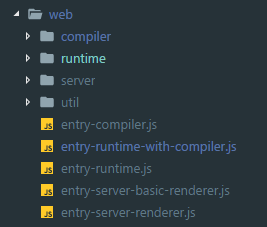
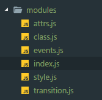

# 关于 `Viola` 接入 `Vue`
<!-- TOC -->

- [关于 `Viola` 接入 `Vue`](#关于-viola-接入-vue)
  - [接入的步骤应该是怎么的呢 ?](#接入的步骤应该是怎么的呢-)
  - [`Vue` 的项目目录](#vue-的项目目录)
  - [平台相关代码](#平台相关代码)
  - [构建最简单的 Viola-vue](#构建最简单的-viola-vue)
  - [**`Viola-vue`**](#viola-vue)
  - [对于 `SFC` 单文件还需要做的事情](#对于-sfc-单文件还需要做的事情)
  - [Code](#code)

<!-- /TOC -->
## 接入的步骤应该是怎么的呢 ?

  整理出来的大致是：

  - 认识 `Vue` 整体的架构
  - 修改提供给 `Vue` 的**平台**代码，包括有：
    - 运行时
      - 组件
      - 指令
      - `modules` (用于 `patch` 后的 `update` 操作)
    - 模板编译代码
    - 不同版本的构建入口
  - 增加自己平台的构建配置
  - 构建 Viola-vue-framework

  对于 支持 `.vue` 单文件组件，需要额外再做的是：

  - 根据上面的模板编译代码进行构建出来一个编译器 `template-compiler`
  - 需要再编写或改造一个适用于当前平台的 `vue-loader`
  - 此后，当我们在加载 `.vue` 单文件组件时, 由 `loader` 转换为 `js`

  那么接下来，定一个小目标先 ———— 在 `Viola` 实例化一个 `Vue`
  
  按照这个步骤来尝试一下 😝

## `Vue` 的项目目录

  个人整理出来一份 `Vue` 的项目目录， 希望对 `Vue` 框架能有一个整体的认识，见下图：

  

  可以看出，我们需要**重点关注**的是：

  - `script`
  
    **构建**相关，我们需要构建出来一个自己的 `vue` 版本

  - `src/core`

    `Vue` 的**运转核心**，包括 `virtual dom`、响应式

  - `src/platforms`

    **平台相关代码**，这正是我们要**重点攻克**的一个地方，是接入的一个入手点

  有了一个整体上的认识，并有入手点后，接下来该动手啦！我们先从 **平台相关代码** 开始

## 平台相关代码

  在 `src/platforms` 目录中，可以看到的两个文件目录： Web 和 Weex

  所以相应的，我们建立自己的目录 `Viola`

  Web 目录时 Vue 用来构建用于 浏览器端 和 SSR， Weex 目录为适配 Weex 平台。那里面都是些什么内容？？
  以 Web 为例：
  

  那这几个又是用来干嘛的呢？

  - `compiler`：

    该目录的入口 `index.js`：
    ``` javascript
    import { baseOptions } from './options'
    import { createCompiler } from 'compiler/index'

    const { compile, compileToFunctions } = createCompiler(baseOptions)

    export { compile, compileToFunctions }
    ```
    这个文件向外输出了 `compile` 和 `compileToFunctions`

    - `compile` 是一个编译器，它会将传入的 `template` 转换成对应的 `AST` 、 `render` 函数以及 `staticRenderFns` 函数。
   
    - `compileToFunctions` 则是带缓存的编译器，同时 `staticRenderFns` 以及 `render` 函数会被转换成 `Funtion` 对象。

    `createCompiler` 用以创建编译器，返回值就是 `compile` 以及 `compileToFunctions` 。
  
      因为不同平台有一些不同的配置项 `options` ，
    所以 `createCompiler` 会根据平台区分传入一个 `baseOptions` ，会与 `compile` 本身传入的 `options` 合并得到最终的 `finalOptions。`
    
    所以可以看出来的是， `compiler` 对应的是 编译器
    
  - `util`：顾名思义，工具类
  - `server`：SSR 相关，此处不展开
  - `entry-*.js`：构建入口文件
    
    都知道 `Vue` 分为两个版本，运行时、运行时+编译器，它们的入口就对应了下面的两个 `js` 文件 
    
    - `entry-runtime-with-compiler`： 运行时+编译器的 Vue
    - `entry-runtime.js`: 只包含运行时的 Vue

    补充这两个版本的不同之处：运行时+编译器可以将模板字符串编译成为 `JavaScript` 渲染函数的代码，但是 运行时版本 相比之下体积要小大约 `30%` 之多

    > 考虑到我们接下来的 Vue 的使用更多是 单文件形式，也就是说，我们几乎不会直接用到模板字符串编译，这样将大大减少我们Vue的体积，所以我们构建目标 Viola-vue 是**不包含编译器的**

    那么我们从入口文件开始：

    ``` javascript
    // entry-runtime.js

    import Vue from './runtime/index'
    export default Vue
    ```
    只有两行，目标指向 `runtime`
    
  - `runtime`：

    同样，我们从 `index.js` 入手，找到部分关键代码：

    ``` javascript

    // 配置平台的 config
    Vue.config.mustUseProp = mustUseProp
    ...

    // install platform runtime directives & components
    // 安装平台特定的 指令 和 组件
    extend(Vue.options.directives, platformDirectives)
    extend(Vue.options.components, platformComponents)

    // install platform patch function
    // 平台 patch function
    Vue.prototype.__patch__ = inBrowser ? patch : noop

    // public mount method
    // $mount 方法
    Vue.prototype.$mount = function (
      el?: string | Element,
      hydrating?: boolean
    ): Component {
      el = el && inBrowser ? query(el) : undefined
      return mountComponent(this, el, hydrating)
    } 

    ```
    由此可简单总结 `index.js` 做的内容为 3 步：

    - 覆盖 Vue.config 的属性，将其设置为平台特有的一些方法

    - Vue.options.directives 和 Vue.options.components 安装平台特有的指令和组件

    - 自定义 `__patch__` 和 `$mount`

    **也就是说，我们需要至少需要完成上面的东西**

    顺着`import`的资源路径看来源后， 第一感觉：好多内容啊啊，**，我们又需要一个更仔细入手点

    回顾下
    
    ```javascript
    new Vue({ el: '#app' })
    ``` 
    这个过程会经历了什么？
    
    通过 `core/instance/init.js` 我们可以看到初始化 `Vue` 实例的过程：

    ``` javascript
    vm._self = vm
    initLifecycle(vm);  // vm的生命周期相关变量初始化
    initEvents(vm);     // 事件监听初始化
    initRender(vm)      // Render
    callHook(vm, 'beforeCreate')
    initInjections(vm)  // resolve injections before data/props
    initState(vm)       // vm的状态初始化，prop/data/computed/method/watch都在这里完成初始化
    initProvide(vm)     // resolve provide after data/props
    callHook(vm, 'created')

    if (vm.$options.el) {
      vm.$mount(vm.$options.el)
    }
    ```
    这个过程中，`vm` 会被一系列的初始化，最后是通过 `$mount` 进行挂载元素

    初始化操作是在`core`核心代码中实现的，而 `$mount` 是刚刚平台定义的，那么我们是不是就可以先从 `$mount` 进行修改呢？

    ### **`$mount`** 

    `$mount` 是 Vue 挂载元素的入口方法，代码如下：

    ``` javascript
    Vue.prototype.$mount = function (
      el?: string | Element,
      hydrating?: boolean
    ): Component {
      el = el && inBrowser ? query(el) : undefined
      return mountComponent(this, el, hydrating)
    } 
    ```
    里面引用到的外部函数有： `query(el?: string | Element)` 和 `mountComponent(vm, el, hydrating)`

    我们在 `web/util/index` 中可以找到 `query` 函数

    ``` javascript
    export function query (el: string | Element): Element {
      if (typeof el === 'string') {
        const selected = document.querySelector(el)
        if (!selected) {
          return document.createElement('div')
        }
        return selected
      } else {
        return el
      }
    }
    ```
    很明显这是一个只能在浏览器跑的函数，强相关代码 `domcument.querySelector`。

    此外在上面代码中，如果由选择器找不到这个元素，那直接返回一个空的 `div`。那是不是说，我们在 `Viola-web` 层也对应返回一个虚拟`Element` 就可以了？
    
    我们回顾下 `$mount` 目的是什么？？
    
    我个人简单理解中的挂载，其实就是一个替换的过程。
    
    而 `query` 目的就是返回一个 dom 元素，这个 dom 元素供接下来的过程进行挂载替换，最终 Vue 实例的 `render` 内容才可以在页面上展示出来

    也就是说，页面要有 Vue 实例转换的内容，就需要 `query` 函数返回的元素需要存在于当前的 `dom tree` 上, 所以我们不能简单地在 `Viola-web` 层也对应返回一个空的虚拟 `Element`，我们需要额外进行 `append` 的操作，让它存在于当前的 `dom tree` 上

    截取**当前 `Viola-vue` 的代码实现**：

    ``` javascript
    export function query (el: string | Element, document: Object) {
      // vue 在后续mount过程需要 hasAttribute 和 removeAttribute
      // make vue happy :)
      let p = {
        hasAttribute() { return false },
        removeAttribute() { return false }
      }
      // 自己虚拟出一个节点放入domTree中，后续 Vue 将用新element替换这个placeHolder
      const placeholder = doc.createElement('div')
      doc.body.appendChild(placeholder)
      Object.assign(placeholder, p)
      return placeholder
    }
    ```
    ( 其实就是返回一个用来占位的，我们并没有用到 `el` )

    垫上了 `query`，接下来就是 `mountComponent(vm, el, hydrating)` 的过程了

    ### **`mountComponent`**

    `mountComponent` 方法在 `core/instance/lifecycle.js`, 这个方法主要的操作包括有：
      - 生成 `updateComponent` 函数，用于 vue 实例的自更新

      ``` javascript
      updateComponent = () => {
        vm._update(vm._render(), hydrating)
      }
      ```
      
      - `new Watcher`， 将上一步生成的函数作为参数传入 `Watcher`

      ``` javascript
      new Watcher(vm, updateComponent, noop, {
        before () {
          if (vm._isMounted) {
            callHook(vm, 'beforeUpdate')
          }
        }
      }, true /* isRenderWatcher */)
      ```

    也就是侧面说明，`updateComponent` 是在 `Watcher` 中被调用

    ### 简单带过 **`Watcher`**
    
    在 `Watcher` 中， `updateComponent` 是在 `get()` 被调用
    ``` javascript
    // 部分代码
    // new 时保存起来
    if (typeof expOrFn === 'function') {
      this.getter = expOrFn
    }
    // get 
    get () {
      ...
      value = this.getter.call(vm, vm)
      ...
    }
    ```

    ### **`updateComponent`**

    回到这个函数，函数里执行的有 `vm._render` 和 `vm._update`

      ``` javascript
      updateComponent = () => {
        vm._update(vm._render(), hydrating)
      }
      ```

    - `vm._render`： 生成 `Vue` 中的 虚拟 `DOM`
    - `vm._update`:  将 `_render` 生成的 `vdom` 进行 `patch` 过程、进而渲染

      ``` javascript
      if (!prevVnode) {
        // initial render
        vm.$el = vm.__patch__(vm.$el, vnode, hydrating, false /* removeOnly */)
      } else {
        // updates
        vm.$el = vm.__patch__(prevVnode, vnode)
      }
      ```
      (补充：`patch` 过程分为初次渲染和更新渲染)
    
    哎哎哎？ `patch` 方法刚刚在平台代码中定义过！！🤔

  ### **`__patch__`**

  回来看看 `patch` 
  ``` javascript
  import * as nodeOps from 'web/runtime/node-ops'
  import { createPatchFunction } from 'core/vdom/patch'
  import baseModules from 'core/vdom/modules/index'
  import platformModules from 'web/runtime/modules/index'

  const modules = platformModules.concat(baseModules)

  export const patch: Function = createPatchFunction({ nodeOps, modules })
  ```

  注意到这两个外部引用：

  ``` javascript
  import * as nodeOps from 'web/runtime/node-ops'
  import platformModules from 'web/runtime/modules/index'
  ```

  可以看到的是这两个引用来源是 `platforms/web`，也就是属于平台拓展的

  我们先看第一个：

  ### **`node-ops.js`**

  `node-ops.js` 里面全都是浏览器操作 `DOM` 的方法！比如有 `createElement()、appendChild()` 等等
  
  做个标记，这**整个模块都要重写为 `Viola-web` 端的方法**

  比如 `setTextContent` 方法
  ``` javascript
  // web
  function setTextContent (node: Node, text: string) {
    node.textContent = text
  }

  // Viola
  function setTextContent (node, text) {
    if (node.nodeType === 3) {
      node.setText(text)
    } else if (node.parentNode) {
      node.parentNode.setAttr(value, text)
    }
  }
  ```

  ### **`platformModules`**

  `platformModules` 主要是定义对 `attrs`、`class`、`events`、`style` 的创建和更新的方法（`create & update`）, 目录如下：

  

  可以看出，这整个也都是我们需要覆盖重写的，比如 `attrs.js` 就是重写为更新 `Viola dom` 的属性。
  （这边代码量较大，不贴代码了）

  ### **回到 `__patch__`**
  
  了解过、改造过 `node-ops.js` 和 `platformModules`，我们回到 `__patch__` 。

  `__patch__` 过程，就是同层比较节点的差异，发现差异后，就用我们刚刚拓展的平台方法 `nodeOps/platformModules` 进行更新。

  至此，在大方向上，我们 `new Vue` 实例的元素内容就已经更新到页面了。

## 构建最简单的 Viola-vue

  了解了如何添加 Viola 平台代码后，接下来就是构建了

  Vue 的构建是采用 `Rollup`，我们可以增加 `config.js` 里面的构建项，如：

  ``` javascript
  'viola-framework': {
    viola: true,
    entry: resolve('viola/framework.js'),
    dest: resolve('packages/viola-vue-framework/index.js'),
    format: 'es',
    env: 'development'
  }
  ```

  并增加对应的 `npm script`

  ``` javascript
  "dev:viola": "rollup -w -c scripts/config.js --environment TARGET:viola-framework"
  ```

## **`Viola-vue`**

  上面只是一个大致的过程，具体的改动还有不少。现在 `Viola-vue` 在 `Viola` 类似实现：

  ``` JavaScript
  new Vue({
    el: 'Viola',
    data: { ...data },
    methods: { ...methods },
    render: function (h) {
      return h('div', {
        attrs: {...属性},
        style: {...样式},
        on: {
          click: this.clickHandler
        }
      })
    }
  })

  ```
## 对于 `SFC` 单文件还需要做的事情

- 模板编译代码进行构建出来一个编译器 `template-compiler`

- 需要再编写或改造一个适用于当前平台的 `vue-loader`

  `loader` 转换出的 `js` 不应依赖到浏览器，`style` 应该是附加到每一个虚拟dom上，而不是样式表，......

当我们在加载 `.vue` 单文件组件时, 由 `loader` 转换为 `js` 执行

`loader` 正在实现中...

## Code

当前代码是 fork 了 vue，进行自己修改，github 地址：
[`Viola-vue`](https://github.com/RonkTsang/vue)